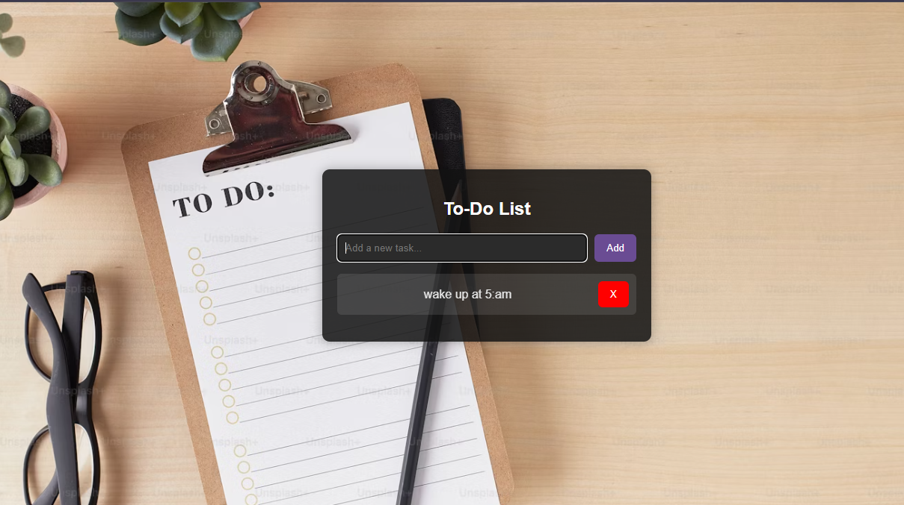

# To-Do List App

## Description
This is a simple To-Do List app built with HTML, CSS, and JavaScript. It allows users to add, delete, and mark tasks as completed.

## Screenshot

 
## How to Use
1. Clone the repository.
2. Open the `index.html` file in your browser.
